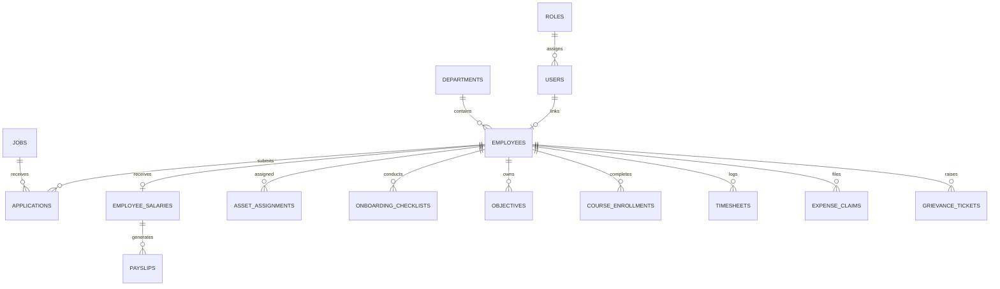

# Complete Relational Database Schema & Entity Relationship Specification

## Overview
This document contains the complete database schema specification for all 34 relational entity tables registered in the **AI-Powered HR, Recruitment & Employee Management Platform**.

---

## Entity Relationship Overview Diagram

---

## Entity Table Specifications

### 1. User Account Entities
- **`roles`**: System user role definitions (`Admin`, `HR`, `Recruiter`, `Employee`, `Candidate`, `Interviewer`).
- **`users`**: Authentication credentials, password hash, email index, phone number, active status, and role reference.

### 2. Department & Employee Directory Entities
- **`departments`**: Organizational structure, department code, description, location, and employee count.
- **`employees`**: Employee code, first/last name, email, phone, department ID, user ID link, designation, joining date, employment type (`Full Time`, `Contract`, `Intern`), and status (`Active`, `Inactive`, `On Leave`).

### 3. Recruitment ATS Entities
- **`jobs`**: Job posting requisitions, title, department ID, position level, employment type, location, experience range, salary budget range, description, requirements, status (`Draft`, `Open`, `Closed`, `Archived`), and posting dates.
- **`candidates`**: Talent pool candidates, candidate code, first/last name, email, phone, current company, experience years, notice period days, expected CTC, skill tags, user ID link, status (`Available`, `In Process`, `Hired`, `Archived`).
- **`applications`**: Job applications link candidate ID to job ID, stage status (`Applied`, `Shortlisted`, `Screening`, `Interview Scheduled`, `Offered`, `Accepted`, `Hired`, `Rejected`), cover letter text, match score percentage, and recruiter notes.
- **`resumes`**: Uploaded resume documents, candidate ID link, file name, file path, parsed text snippet, extracted skills, and upload timestamp.
- **`interviews`**: Scheduled interview rounds, application ID link, candidate ID, job ID, interviewer user ID, round name (`HR`, `Technical 1`, `Technical 2`, `System Design`, `Executive`), scheduled start/end time, meeting link, status (`Scheduled`, `Completed`, `Cancelled`).
- **`interview_feedback`**: Interview scorecards, interview ID link, interviewer ID, technical rating (1-5), communication rating (1-5), problem solving rating (1-5), overall recommendation (`Strong Hire`, `Hire`, `Hold`, `Reject`), detailed feedback comments.
- **`offers`**: Formal offer letters, candidate ID, job ID, proposed CTC, basic pay, HRA, allowances, joining bonus, stock options, proposed designation, joining date, offer expiration date, status (`Draft`, `Sent`, `Accepted`, `Declined`, `Expired`).

### 4. Attendance & Leave Entities
- **`attendances`**: Daily check-in/out logs, employee ID, attendance date, check-in time, check-out time, total working hours, status (`Present`, `Late`, `Half Day`, `Absent`), location IP, and remarks.
- **`leave_requests`**: Employee leave applications, employee ID, leave type (`Casual`, `Sick`, `Earned`, `Maternity`, `Paternity`, `Unpaid`), start date, end date, total days, reason text, status (`Pending`, `Approved`, `Rejected`, `Cancelled`), approved by user ID.

### 5. Performance & Review Entities
- **`performance_reviews`**: Annual performance reviews, employee ID, reviewer user ID, review cycle label (`2025-Annual`, `2026-H1`), technical rating, productivity rating, teamwork rating, overall score, key achievements text, areas of improvement text, status (`Self Assessment`, `Manager Review`, `HR Calibration`, `Completed`).

### 6. Payroll & Compensation Entities
- **`salary_structures`**: Grade band templates, title, code, basic pay %, HRA %, special allowance %, employer PF %, employee PF %.
- **`employee_salaries`**: Compensation records, employee ID, annual CTC, monthly gross, basic pay, HRA, allowances, PF deduction, ESI deduction, professional tax, TDS deduction, bank name, account number, IFSC code, PAN number, effective date, active flag.
- **`payroll_runs`**: Monthly payroll processing batches, pay period month/year, total headcount, total gross payout, total deductions, total net payout, status (`Draft`, `Processing`, `Approved`, `Paid`), processed by user ID, approved by user ID.
- **`payslips`**: Individual employee salary slips, payroll run ID, employee ID, month/year, working days, payable days, earnings breakdown, deductions breakdown, net salary, payment status (`Pending`, `Paid`), payment mode, transaction reference.
- **`tax_declarations`**: Annual investment proof declarations, employee ID, financial year (`2026-2027`), tax regime (`Old`, `New`), 80C amount, 80D amount, HRA rent paid, Section 24B interest, status (`Draft`, `Submitted`, `Verified`), comments.

### 7. Asset & IT Management Entities
- **`asset_categories`**: Hardware category templates, name, code, description.
- **`assets`**: Hardware inventory items, asset tag barcode, name, category ID, serial number, purchase date, purchase cost, vendor name, warranty expiry date, condition, status (`Available`, `Assigned`, `Under Maintenance`, `Decommissioned`).
- **`asset_assignments`**: Assignment history, asset ID, employee ID, assigned date, return date, condition on return, assigned by user ID, status (`Active`, `Returned`).
- **`asset_maintenances`**: Maintenance logs, asset ID, maintenance date, provider name, cost, issue description, resolution notes.
- **`software_licenses`**: License tracking, software name, license key, total seats, assigned seats, purchase date, expiry date, annual cost.
- **`it_tickets`**: IT support requests, ticket number, employee ID, asset ID link, category (`Hardware`, `Software`, `Network`), subject, description, priority (`Low`, `Medium`, `High`, `Critical`), status (`Open`, `In Progress`, `Resolved`, `Closed`).

### 8. Onboarding & Exit Clearance Entities
- **`onboarding_checklists`**: Orientation plans, employee ID, buddy employee ID, start date, target completion date, completion %, status (`Pending`, `In Progress`, `Completed`).
- **`onboarding_tasks`**: Checklist task items, checklist ID, task title, department responsible (`IT`, `HR`, `Finance`, `Admin`), status (`Pending`, `Completed`), completed date.
- **`employee_documents`**: Digital document vault, employee ID, document type (`Aadhaar`, `PAN`, `Degree`, `Relieving Letter`), file path, upload date, verification status (`Pending`, `Verified`, `Rejected`).
- **`resignation_requests`**: Resignation submissions, employee ID, resignation date, requested last working day, approved last working day, notice period days, reason text, status (`Submitted`, `Approved`, `Rejected`, `Withdrawn`).
- **`exit_clearances`**: Multi-department clearances, resignation ID, department name (`IT`, `Finance`, `Admin`, `HR`, `Security`), cleared flag, dues amount, remarks text, cleared by user ID, cleared date.
- **`fnf_settlements`**: Full & final financial statements, resignation ID, employee ID, last working day, payable days, earned salary, gratuity amount, leave encashment amount, notice shortfall recovery amount, pending dues deduction, total net settlement payout, payment status (`Draft`, `Approved`, `Paid`).

### 9. OKRs & 360-Degree Performance Entities
- **`objectives`**: Cascading OKRs, title, description, period quarter (`2026-Q1`), level (`Company`, `Department`, `Individual`), department ID, owner employee ID, start/end dates, weightage, progress %, status (`On Track`, `Behind`, `At Risk`, `Completed`).
- **`key_results`**: Measurable key results, objective ID, title, target value, current value, unit (`%`, `INR`, `Count`), weight, progress %.
- **`review_cycles`**: Performance cycle schedules, title, cycle type (`Annual`, `Quarterly`), start/end dates, status (`Open`, `In Progress`, `Closed`).
- **`feedback_360`**: 360-degree reviews, cycle ID, evaluator employee ID, evaluatee employee ID, relationship (`Peer`, `Manager`, `Direct Report`), leadership score, technical score, communication score, teamwork score, strengths text, areas for growth text.
- **`pips`**: Performance improvement plans, employee ID, manager employee ID, start/end dates, reason text, goals text, status (`Active`, `Successful`, `Unsuccessful`).

### 10. LXP & Training Entities
- **`courses`**: Learning courses, title, code, description, category, level, duration hours, provider name, mandatory flag, active flag.
- **`course_modules`**: Module units, course ID, order index, title, content type (`Video`, `Reading`, `Quiz`), content URL/text, estimated minutes.
- **`course_enrollments`**: Employee enrollments, course ID, employee ID, enrolled date, due date, status (`Enrolled`, `In Progress`, `Completed`), progress %, score achieved.
- **`quizzes`**: Assessment quizzes, course ID, title, passing score %, total marks.
- **`quiz_questions`**: Quiz questions, quiz ID, question text, option A, option B, option C, option D, correct option (`A`, `B`, `C`, `D`), marks.
- **`certificates`**: Issued certificates, certificate number, enrollment ID, employee ID, course name, issued date, valid until, verification code.
- **`quiz_attempts`**: Employee quiz score attempts, quiz ID, employee ID, score %, passed flag, attempted timestamp.

### 11. Timesheet & Shift Entities
- **`timesheets`**: Weekly timesheets, employee ID, week start/end dates, total hours, billable hours, status (`Draft`, `Submitted`, `Approved`, `Rejected`), approved by user ID.
- **`timesheet_entries`**: Daily timesheet task lines, timesheet ID, entry date, project name, task description, hours logged, billable flag.
- **`shifts`**: Shift schedules, name, code, start time, end time, break duration minutes.
- **`employee_shift_rosters`**: Employee rosters, employee ID, shift ID, roster date, status (`Assigned`, `Completed`).
- **`overtime_claims`**: OT claim requests, employee ID, claim date, overtime hours, multiplier rate, total payout, reason text, status (`Pending`, `Approved`, `Rejected`).

### 12. Expense & Travel Entities
- **`expense_categories`**: Policy categories, name, max limit, receipt required flag.
- **`expense_claims`**: Reimbursement claims, claim number, employee ID, title, total amount, status (`Submitted`, `Approved`, `Paid`), approved by user ID.
- **`expense_items`**: Claim line items, claim ID, category ID, item date, description, amount, receipt filename.
- **`travel_requests`**: Business travel approvals, request number, employee ID, destination, purpose, start/end dates, estimated cost, status (`Pending Approval`, `Approved`, `Rejected`).

### 13. Compliance & Audit Entities
- **`grievance_tickets`**: Confidential grievances, ticket number, raised by employee ID, category, subject, description, is anonymous flag, status (`Open`, `Under Investigation`, `Resolved`, `Closed`).
- **`company_policies`**: Policy documents, title, code, category, content text, version, effective date, active flag.
- **`policy_acknowledgments`**: Policy digital signatures, policy ID, employee ID, acknowledged timestamp.
- **`audit_logs`**: Immutable security audit logs, user ID, user email, action, entity type, entity ID, details JSON string, IP address, timestamp.

### 14. Workforce Analytics Entities
- **`workforce_plans`**: Departmental headcount targets, department ID, plan year, target headcount, current headcount, approved budget.
- **`attrition_risk_scores`**: Flight-risk analytics, employee ID, risk level (`Low`, `Medium`, `High`, `Critical`), risk score %, contributing factors JSON, evaluated date.
- **`salary_benchmarks`**: Market pay standards, designation, market median annual ctc, benchmark source, updated date.
