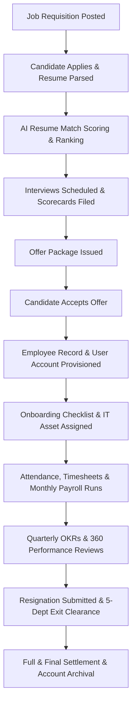

# Enterprise HR Module Workflow Map & System User Manual

## Overview
This document provides a comprehensive end-to-end user manual and workflow diagram map detailing operational procedures, system triggers, data flows, and approval chains across all 13 core functional areas of the **AI-Powered HR, Recruitment & Employee Management Platform**.

---

## 1. End-to-End Employee Lifecycle Flow

---

## 2. Detailed Module Workflow Specifications

### Module 1: Talent Acquisition & ATS Workflow
1. **Requisition Approval**: Recruiter or Manager submits job posting requisition specifying title, department, employment type, CTC budget range, and required skills.
2. **Public Sourcing**: Job listing appears on the candidate career portal. Candidates submit applications with attached PDF/DOCX resumes.
3. **AI Parsing & Scoring**: Background engine extracts text, parses candidate contact details, tags skills, and calculates TF-IDF match score against job description.
4. **Recruiter Shortlisting**: Recruiter views candidate pool sorted by AI Match %, reviews match explanations, and updates application stage to `Shortlisted`.
5. **Interview Scheduling**: Recruiter selects candidate, sets round name (`Technical 1`, `System Design`), selects interviewer, meeting date/time, and generates meeting link.
6. **Scorecard Submission**: Interviewer accesses evaluation form, rates technical, communication, and problem-solving skills on a 1-5 scale, and submits hiring recommendation (`Strong Hire`, `Hire`, `Hold`, `Reject`).
7. **Offer Generation**: HR creates offer package containing salary components, ESOPs, and joining date. Candidate reviews and accepts via candidate portal.

---

### Module 2: Employee Onboarding & Asset Provisioning
1. **Account Creation**: Candidate conversion generates active `Employee` record and associated `User` login credentials.
2. **Onboarding Checklist**: Automated task assignment across IT setup, Finance bank account linking, HR document submission, and buddy assignment.
3. **Hardware Assignment**: IT Administrator selects available asset (e.g., MacBook Pro), assigns tag to employee ID, and logs digital handover receipt.

---

### Module 3: Attendance, Leave & Timesheets
1. **Daily Check-In**: Employee logs check-in/out time on self-service portal. System calculates net work hours and flags late arrivals.
2. **Leave Request**: Employee selects leave type (`Casual`, `Sick`, `Earned`), specifies date range, and submits. Manager receives notification to Approve or Reject.
3. **Weekly Timesheets**: Employee logs daily project work hours, task notes, and billable flags. Overtime hours (>40 hrs/week) automatically calculate OT payout premiums (1.5x weekday, 2.0x weekend).

---

### Module 4: Compensation, Payroll & Tax Declarations
1. **Tax Declaration**: Employee selects Old or New Tax Regime for FY 2026-2027 and submits investment proofs under 80C, 80D, HRA, and Section 24B.
2. **Monthly Payroll Run**: HR executes monthly payroll run. System calculates prorated basic pay based on payable days, calculates TDS deductions, PF/ESI/PT deductions, and generates individual payslips.
3. **Bank Batch Payout**: System exports corporate payout file (HDFC CMS / ICICI CIB format) for direct deposit processing.

---

### Module 5: OKRs, Performance & Learning (LXP)
1. **OKR Alignment**: Department and individual objectives established with measurable Key Results. Progress updates automatically recalculate objective health scores.
2. **360-Degree Feedback**: Annual or quarterly 360 reviews gather feedback from peers, managers, and direct reports across Leadership, Technical, Communication, and Teamwork competencies.
3. **LXP Course Completion**: Employee enrolls in internal training courses, completes learning modules, takes end-of-course quizzes, and earns verified certificates upon passing (>= 70%).

---

### Module 6: Resignation & Exit Clearance (FnF)
1. **Resignation Submission**: Employee submits resignation stating reason and requested last working day. System calculates notice period shortfall.
2. **Multi-Dept Clearance**: 5 departments (IT, Finance, Admin, HR, Security) review dues, hardware returns, and sign off clearance.
3. **FnF Financial Settlement**: System calculates Gratuity Act payout (`15 * Basic * Tenure / 26`), leave encashment, notice pay recovery, and generates net FnF settlement statement.
