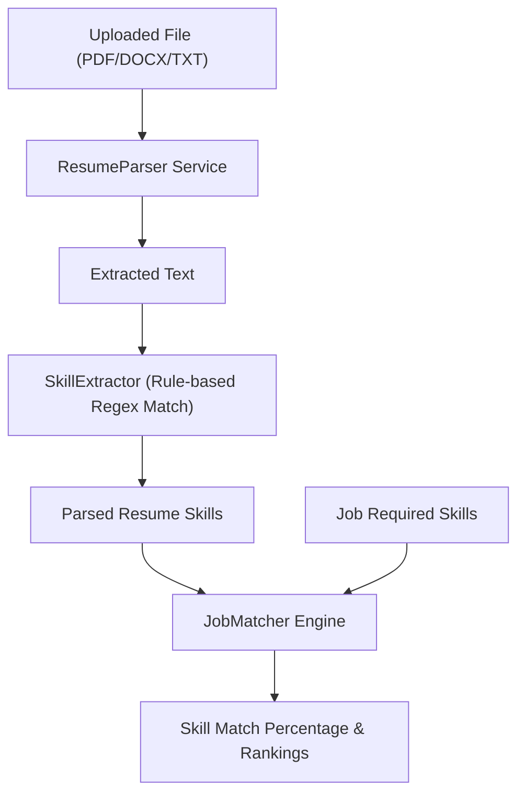

# Resume Management, Skill Extraction & Job-Candidate Matching Module

## Overview

The Resume Management and Job Matching module adds automated resume parsing, rule-based skill extraction, and candidate-job matching capabilities to the AI-Powered HR Platform.

## Key Features

1. **Resume Upload & File Management**:
   - Supports uploading PDF, TXT, and DOCX resumes.
   - Restricts file size to a 5 MB ceiling.
   - Enforces safe filename generation using UUIDs to protect against path traversal and file execution vulnerabilities.
   - Candidate self-service upload and Recruiter/HR upload for existing candidates.

2. **Resume Text Extraction (`ResumeParser`)**:
   - Parses plain text from TXT files, PDF documents (`PyPDF2`), and DOCX files (`python-docx`).
   - Handles text extraction failures gracefully without exposing server internals or throwing unhandled exceptions.

3. **Skill Database & Rule-Based Skill Extraction (`SkillExtractor`)**:
   - Maintains a central database taxonomy of skills across 10 categories (Programming, Web Development, Database, Cloud, Cybersecurity, Data, DevOps, Testing, Tools, Other).
   - Uses **AI-assisted rule-based skill extraction** with word boundaries (`\b`) to match keywords accurately (e.g. matching "Git" without accidentally matching inside "digital").
   - Normalizes extracted skills into deduplicated JSON arrays stored directly on the `Resume` model.

4. **Job-Candidate Skill Matching (`JobMatcher`)**:
   - Calculates skill match percentages using the standard formula:
     $$\text{Match Percentage} = \frac{\text{Matched Required Skills}}{\text{Total Required Skills}} \times 100$$
   - Handles zero required skills gracefully without division by zero.
   - Produces candidate rankings for Recruiters/HR per job and job rankings for Candidates.

> [!NOTE]
> **AI-Assisted Scoring System Disclaimer**: The skill extraction and matching system is a lightweight, rule-based scoring engine designed for fast execution, easy testing, and predictability. It does NOT use a heavy machine-learning model or OCR pipeline.

## Data Privacy & Safety

- **100% Fictional Data**: All demo candidate profiles, resume files, and extracted skills consist strictly of synthetic data (e.g., `candidate001@example.com`).
- **No Sensitive Personal Information**: The system does not collect or store government IDs, Aadhaar, PAN, banking information, or medical data.

## API Endpoints

### Resume Management APIs
- `POST /api/resumes/upload`: Upload and automatically parse a candidate resume.
- `GET /api/resumes`: Fetch candidate resumes (Candidate sees own; HR/Recruiter sees all).
- `GET /api/resumes/<id>`: Get single resume details.
- `DELETE /api/resumes/<id>`: Delete resume and remove file from disk.
- `GET /api/resumes/<id>/download`: Securely download original resume file.
- `POST /api/resumes/<id>/extract-skills`: Trigger skill extraction on resume text.

### Job Matching APIs
- `GET /api/jobs/<job_id>/match/<candidate_id>`: Detailed match comparison between job and candidate.
- `GET /api/candidates/<candidate_id>/matches`: Ranked jobs for a specific candidate.
- `GET /api/jobs/<job_id>/matches`: Ranked candidates for a specific job.

## Technical Architecture

## Security Controls

- **File Validation**: MIME-type and extension check (`ALLOWED_EXTENSIONS = {'pdf', 'txt', 'docx'}`).
- **Path Traversal Protection**: Uses `werkzeug.utils.secure_filename` combined with unique UUID prefixes.
- **RBAC**: Protected routes using JWT identity verification and custom `role_required` decorators.
- **Audit Logging**: All upload, delete, and skill extraction actions log audit events without recording sensitive payload text.
